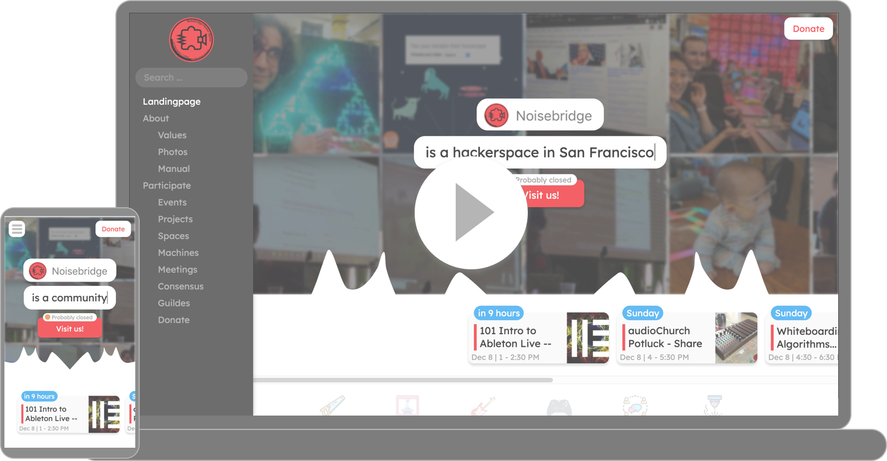
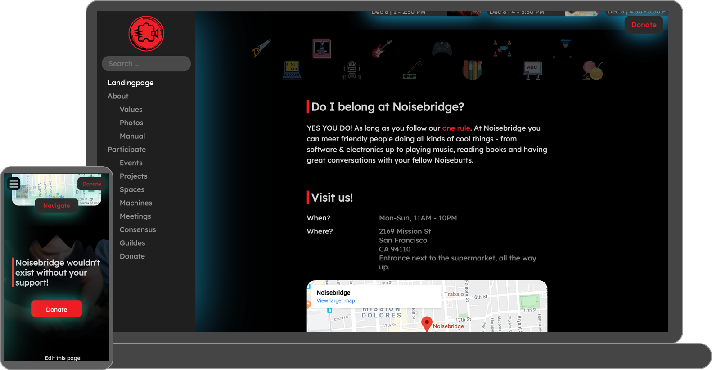
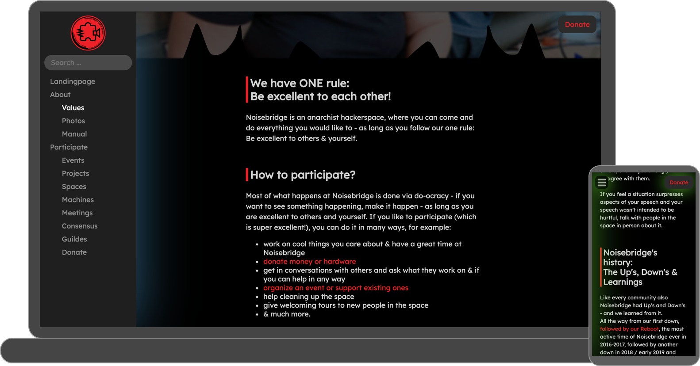
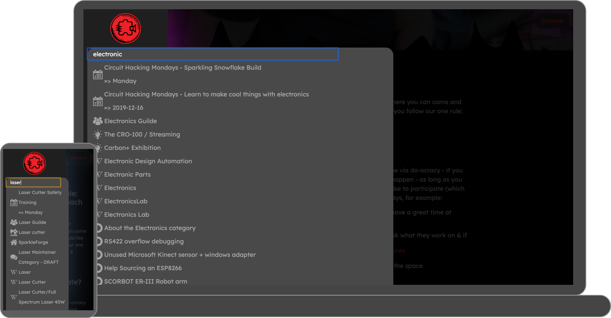
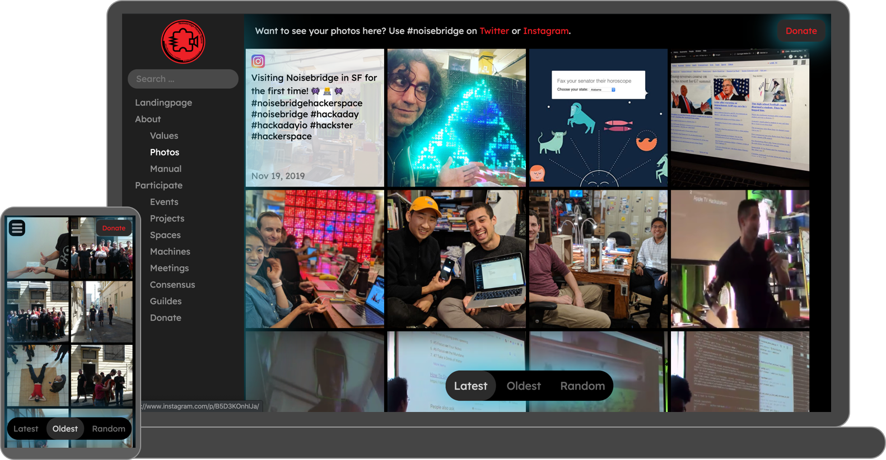
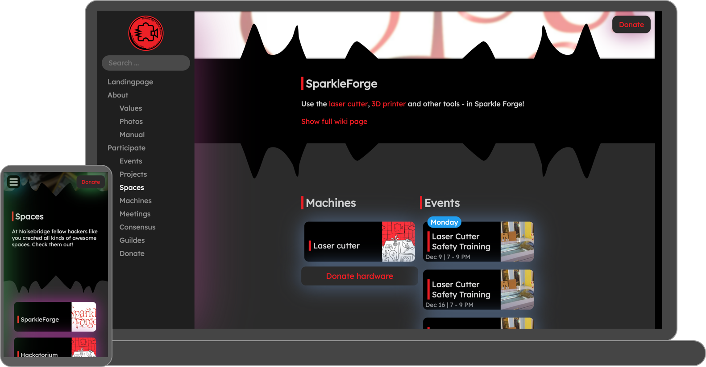
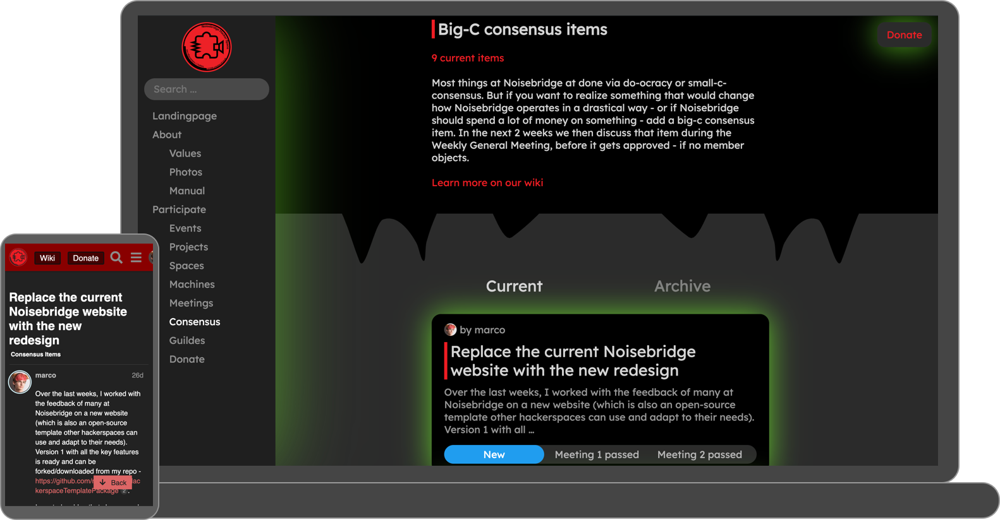
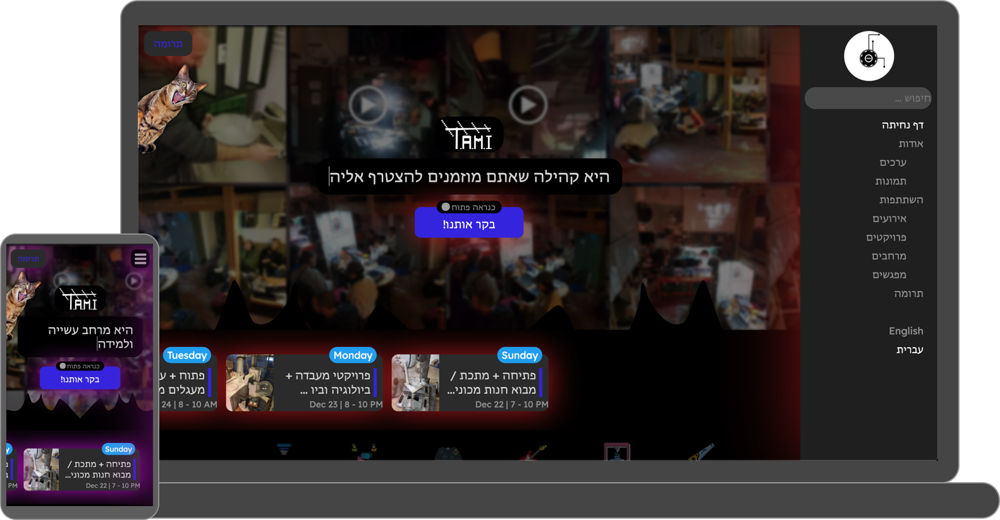

Create an amazing new website for your local hackerspace within minutes!

=> [🌍 Example websites](#examples)

=> [🌟 Features](#features)

=> [🛠 How to setup](#setup)

=> [🧹 How to customize](#customize)

=> [💻 How to contribute](#contribute)

<br/><br/>
[](https://www.youtube.com/watch?v=lsepx_z1kbU)

<br/><br/>


Take a look at the hackerspaces which already use this template!:)

- **TAMI, Tel Aviv (Israel):** [https://beta.telavivmakers.org/](https://beta.telavivmakers.org/)
- **Noisebridge, San Francisco (USA):** about to launch, needs to be deployed
- and maybe your hackerspace soon as well?:)

<br/><br/>


This website template has a lot of super useful features for your hackerspace! Don’t need all of them? Don’t worry, you can easily deactivate or customize them as well!

=> [💡LED Dark Mode!](#dark-mode)

=> [🛬Landingpage with all the essentials](#landingpage)

=> [ℹ️About section, tell your hackerspace’s story](#about)

=> [🔍Search everything, everywhere](#search)

=> [🗓Create & see all your events](#events)

=> [🖼All photos in one place](#photos)

=> [🛠Show your projects](#projects)

=> [🏠List your spaces & machines](#spaces)

=> [📝Create, archive and see all your meeting notes](#meeting-notes)

=> [👥Consensus Items](#consensus)

=> [💲Tell people how to donate](#donate)

=> [🌍Multi-language support](#languages)

Want more? [Learn how to contribute](#contribute)!

<br/><br/>


The most important key feature first - THIS WEBSITE HAS LEDs!!! *

I mean… do you really need anything else to convince your hackerspace community?

*if the website visitor has Dark Mode activated on their device / operating system
<br/><br/>


<br/><br/>


- "Currently open" indicator (automatically updated every minute)
- hackerspace short description
- upcoming events (automatically updated every minute)
- overview of what areas your hackerspace covers & quick links to search
- address, map & opening hours

<br/><br/>


<br/><br/>


- the one rule - be excellent to each other
- how to participate
- your hackerspace history



<br/><br/>


- [Discourse](https://discourse.org/)
- [Wiki](https://www.mediawiki.org/wiki/MediaWiki)
- events
- projects
- meeting notes
- machines
- spaces
- social media channels



<br/><br/>


- auto import existing events from [Meetup](https://www.meetup.com/) and your [Wiki](https://www.mediawiki.org/wiki/MediaWiki), via [Cronjob](./cronjobs.txt)
- allow community members to create new events directly via the website (which then get automatically posted to your [Meetup group](https://www.meetup.com/) and [Discourse](https://discourse.org/) as well)


<br/><br/>


- from [Twitter](https://twitter.com/), [Instagram](https://www.instagram.com/), your [Wiki](https://www.mediawiki.org/wiki/MediaWiki) & [Flickr](https://flickr.com/)
- including preview of the connected social media posts
- sort by "Latest", "Oldest" or "Random" - to explore more of your Hackerspace's history!
- always see the latest photos on the landingpage (automatically updated every minute)



<br/><br/>


- auto import projects from your [Discourse group](https://discourse.org/)
- link to the project section of your [Discourse group](https://discourse.org/) to allow people to create new projects


<br/><br/>


- list all your spaces & most important machines




<br/><br/>


- easy import of existing meeting notes from your [Wiki](https://www.mediawiki.org/wiki/MediaWiki)
- automatically start a new meeting on [Riseup Pad](https://pad.riseup.net/) based on your [meeting notes template](./_database/templates/meeting_notes.txt)
- presenter/note taker mode - to allow everyone to see what the current topic is (and how long the meeting is already going on)
- use #hashtags to tag keywords - which get extracted automatically when you finish a meeting


<br/><br/>


- auto import consensus items from your [Discourse group](https://discourse.org/)
- link to the consensus items section of your [Discourse group](https://discourse.org/) to allow people to create new projects



<br/><br/>


- donation infos accessible from every page
- links to donate money, hardware or organize or volunteer an event


<br/><br/>


- easily switch between languages
- more languages can be easily added via the [translation files](./_database/templates/translations/)




<br/><br/>


**Step 1:** Clone this repo
```
git clone git@github.com:marcoEDU/HackerspaceTemplatePackage.git
```

**Step 2:** [Create & activate a Python virtual environment](https://docs.python.org/3/library/venv.html)

**Step 3:** Via the main folder of this code - execute in your terminal: 

```
pip install -r requirements.txt;python setup.py;python manage.py makemigrations;python manage.py migrate;python manage.py update_database
```

**Step 4:** Customize the settings in [config.json](./config.json) to your hackerspace (and [make sure it's a valid JSON](https://jsonlint.com/), otherwise the server won't be able to start).

**Step 5:** Setup the cronjobs from cronjobs.txt - to keep the database updated


**Step 6:** To add your own logo: Add the following files to [_website/static/images/](./_website/static/images/): 
```
logo.svg
header_logo.jpg
```


**Step 7:** [Create your own favicons](https://www.favicon-generator.org/) and add the following files to [_website/static/images/favicons/](./_website/static/images/favicons/): 
```
favicon.ico
favicon-32x32.png
favicon-16x16.png
apple-touch-icon.png
```

**Step 8:** Add your default background image as "header_banner.jpg" to [_website/static/images/](./_website/static/images/)

**Step 9:** Test your website

**Step 10:** Deploy your website

<br/><br/>


=> [Click to change your default colors & fonts](./_database/CUSTOMIZE/CSS.py)

=> [Click to show templates](./_database/templates/)

=> [Click to show CSS files](./_website/static/css/)

=> [Click to show images](./_website/static/images/)

=> [Click to show JavaScript files](./_website/static/js/)

=> How to add a new page:

-  add a new path in [urls.py](./_database/urls.py)
- add a new view in [views.py](./_database/views.py)
- add the template html in [/templates](./_database/templates/)

<br/><br/>


Want to help improving the website template? [Check out our To Do's Board.](https://github.com/marcoEDU/HackerspaceTemplatePackage/projects/1)