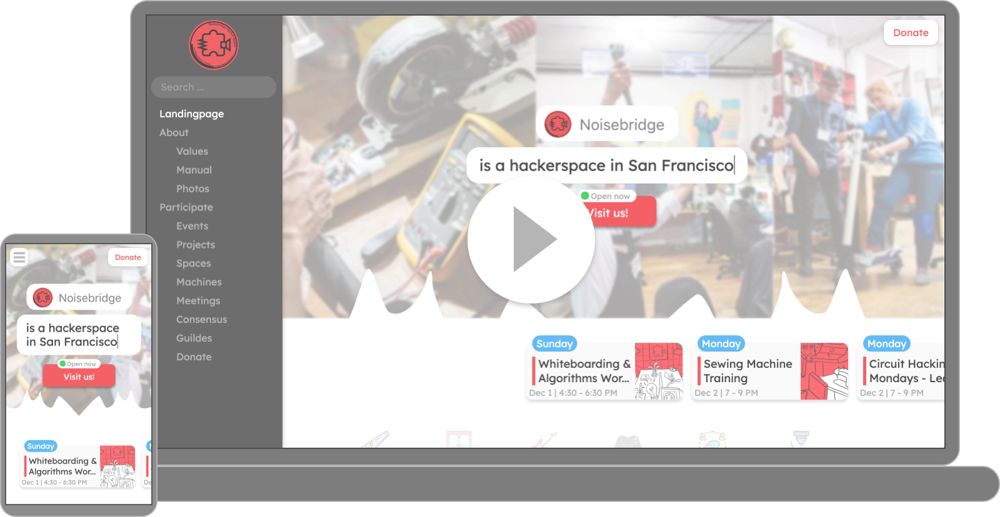

Create an amazing new website for your local hackerspace within minutes!

=> [🌟 Features](#features)

=> [🛠 How to setup](#setup)

=> [🧹 How to customize](#customize)

=> [💻 How to contribute](#contribute)

<br/><br/>
[](https://www.youtube.com/watch?v=lsepx_z1kbU)

<br/><br/>


This website template has a lot of super useful features for your hackerspace! Don’t need all of them? Don’t worry, you can easily deactivate or customize them as well!

=> [💡LED Dark Mode!](#dark-mode)

=> [🛬Landingpage with all the essentials](#landingpage)

=> [ℹ️About section, tell your hackerspace’s story](#about)

=> [🔍Search everything, everywhere](#search)

=> [🗓Create & see all your events](#events)

=> [🛠Show your projects](#projects)

=> [🏠List your spaces & machines](#spaces)

=> [📝Create, archive and see all your meeting notes](#meeting-notes)

=> [👥Consensus Items](#consensus)

=> [💲Tell people how to donate](#donate)

Want more? [Learn how to contribute](#contribute)!

<br/><br/>


The most important key feature first - THIS WEBSITE HAS LEDs!!! *

I mean… do you really need anything else to convince your hackerspace community?

*if the website visitor has Dark Mode activated on their device / operating system
<br/><br/>


<br/><br/>


Tell people what is special about your hackerspace, if the space is currently open, how to get to you and your upcoming events 
<br/><br/>
[](https://media.giphy.com/media/PhZ4vnwqJSuidLycQH/source.gif)

<br/><br/>


[](https://media.giphy.com/media/ejJlMZGeFhQ2kzBtuv/source.gif)

<br/><br/>


[](https://media.giphy.com/media/PhZXasQcgHTOLzSrZX/source.gif)

<br/><br/>


[](https://media.giphy.com/media/hU47h8DA0FY4k0L1DV/source.gif)

<br/><br/>


[](https://media.giphy.com/media/Urynrna0njBO8aOcHV/source.gif)


<br/><br/>


[](https://media.giphy.com/media/KZ44vfSHmTEbqIuLun/source.gif)


<br/><br/>


[](https://media.giphy.com/media/gHEtvxEFLcoViOzgTU/source.gif)


<br/><br/>


[](https://media.giphy.com/media/QYjC6A5guL3dLnWovQ/source.gif)


<br/><br/>


[](https://media.giphy.com/media/kHqtT44bciusHqgwUf/source.gif)


<br/><br/>


**Step 1:** Clone this repo
```
git clone git@github.com:marcoEDU/HackerspaceTemplatePackage.git
```

**Step 2:** Create & activate a Python virtual environment

**Step 3:** To add your own logo: Add the following files to [hackerspace/Website/static/images/](./hackerspace/Website/static/images/): logo.svg, header_logo.jpg

**Step 3.1:** To add your own favicons: Add the following files to [hackerspace/Website/static/images/favicons/](./hackerspace/Website/static/images/favicons/): favicon.ico, favicon-32x32.png, favicon-16x16.png, apple-touch-icon.png

**Step 3.2:** Add your default background image as "header_banner.jpg" to [hackerspace/Website/static/images/](./hackerspace/Website/static/images/)

**Step 4:** Via the main folder of this code - execute in your terminal: 

```
pip install -r requirements.txt;python create_secrets.py;python manage.py makemigrations;python manage.py migrate;python create_config.py;python manage.py update_database
```

**Step 5:** Customize the settings in [config.json](./config.json) to your hackerspace

**Step 6:** Setup the cronjobs from cronjobs.txt - to keep the database updated

**Step 7:** Test your website

**Step 8:** Deploy your website

<br/><br/>


=> [Click to change your default colors & fonts](./hackerspace/CUSTOMIZE/CSS.py)

=> [Click to show templates](./hackerspace/Website/templates/)

=> [Click to show CSS files](./hackerspace/Website/static/css/)

=> [Click to show images](./hackerspace/Website/static/images/)

=> [Click to show JavaScript files](./hackerspace/Website/static/js/)

=> How to add a new page:

-  add a new path in [urls.py](./hackerspace/urls.py)
- add a new view in [views.py](./hackerspace/Website/views.py)
- add the template html in [/templates](./hackerspace/Website/templates/)

<br/><br/>


Want to help improving the website template? [Check out our To Do's Board.](https://github.com/marcoEDU/HackerspaceTemplatePackage/projects/1)